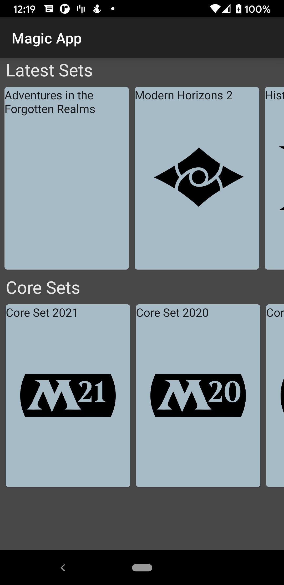

# SandboxApp
A sandbox android app to try new things. Currently holds an app to browse magic the gathering cards using Jetpack
Compose.

# Structure
The `app` module contains most of the code for the app.
The `api` module contains code for working with different services and Retrofit.

## Screenshots

